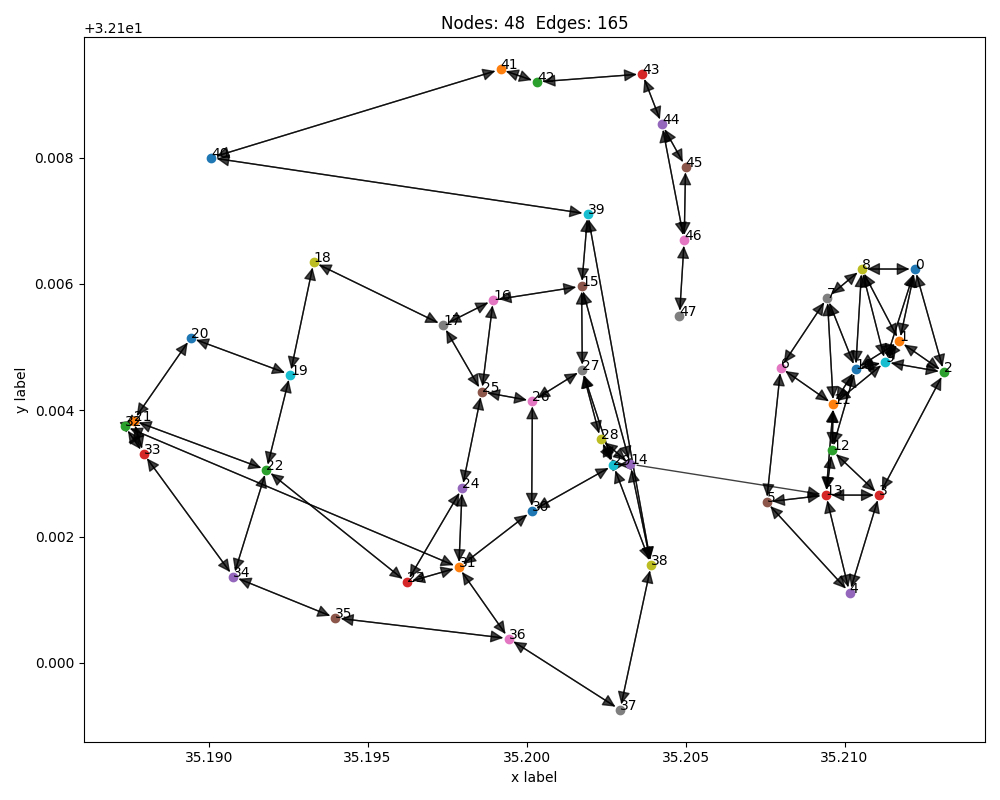
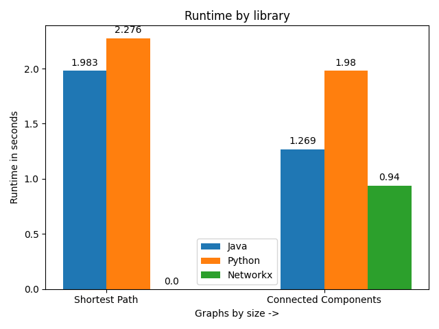
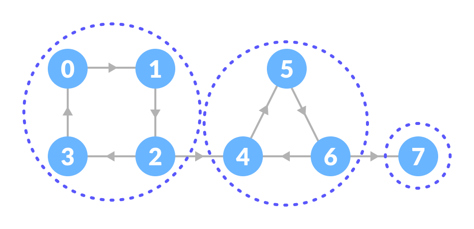

# :mortar_board: Weighted Directed Graph Python Implementation

An implementation of a Weighted Directed graph in Python  
This project in implemented in three different files:  
  
- **DiGraph** - an object representing a graph tha points to all of its containing nodes  
- **NodeData** - an object representing each individual node/vertex in the graph, Each and every vertex hold the information about he's neighbors and edges 
- **GraphAlgo** - an object that implements some basic graph algorithms
- **Comparisons** - a combination of functions that run our project (+ Former Java Ex2) vs. Networkx and compares running time  

## Time Comparisons (Part 3)

In **Comparisons** we run 6 different graphs from the `data/Graphs_on_circle` folder and compare the running time between on three different projects:
- `Networkx`: https://networkx.org/documentation/stable/tutorial.html
- Our former `Ex2 Java` project: https://github.com/ShmuelLa/OOP_ex2
- This repositor 

Because the running time on the small graphs in too small we compared the projects on the biggest graph - `G_30000_240000`

## Main Algorithms Used

### Strongly Connected Components:

An SCC is a component in a graph that contains noded which can reach each other form any direction.
For our SCC algorithm we used a former BFS we used in the previous exam which runs from a node to all of it's neighbors, transposes the graph and checks the directions again.
This time we added a feature to the result of that algorithm that will return the intersection of the two paths the BFS went through.
Than we wrote another function which calss the BFS algorithm for each and every "unvisited"  node (Means that the node itself still doesn't have an SCC).   
> Note: at firsts we implemented and used Tarjan's algorithm with recursive DFS but because of the big graphs we needed to run we reached max recursion depth and after increasing it we reached a Stack Overflow error. so we used a more "simple" algorithm

### Dijkstra Algorithm:
A searching algorithm. in this version of Dijkstra we use a Priority que, that is because we are "traveling" across a Weighted
graph. by using a Priority que(heapq) we can pull the lowest weighted node out with each iteration.
we start by marking our current node as visited (use the node info -"y"), then we travel trough the graph in using BFS algorithm.
each node we come across we first mark the distance as ("inf")-positive infinity, then we calculate the actual distance
and if it's lower than ("inf") we set the nodes weight to that value. next we make a dict of all parents and children.
when all the nodes are visited we backtrack across the parent dict, adding  each node to a list
then return it. with the destination node weight. finally, we reset the graph - marking each node's tag to 0 and each info to "".  
  
## :computer: Main Classes and Methods  
  
### :chart_with_upwards_trend: DiGraph
This class implements a mathematical weighted graph by implements two classes internally
 :one: **NodeInfo** which implements the basic information and methods each node stores
 :two: **EdgeInfo** which stores all the data and methods for all the edges in the graph. This internal class 
 is implemented on top of the received interface's for higher efficiency and complexity of the project.
 Each graph consists of two HashMap data structures. One for the node and the other for the edges.
 Each graph also has an integer that count the edges and the mode count (internal changes count) of the graph

| **Methods**      |    **Details**        | **Complexity** |
|-----------------|-----------------------|----------------|
| `__init__` | Initialization of a new Directed graph     |O(1)
| `v_size()` | Returns the amount of nodes in the graph |O(1)
| `e_size()` | Returns the amount of edges in the graph | O(1) |
| `get_all_v()` | Returns a dictionary of all the nodes| O(1) |
| `addNode()` | Adds a new node to the graph | O(1) |
| `add_edge()` | Connects two nodes in the graph | O(1) |
| `all_in_edges_of_node()` | Returns a dictionary representing the ingoing edges from the node | O(1) |
| `all_out_edges_of_node` | Returns a dictionary representing the outgoing edges from the node | O(1), Originally O(k). k=node degree |
| `get_mc()` | Returns the amount of changes made to the graph | O(1) |
| `removeNode()` | Removed a node from the graph | O(n) |
| `removeEdge()` | Remove an edge between two nodes in the graph | O(1) |
| `to_json()` | Returns a String that represents the graph, in JSON format | O(1) |
| `__eq__()` | Check if two given graphs are equals | O(n) |
| `has_node()` | Check if a given node is inside a graph | O(1) |
| `__str__()` | Returns a String that represents the graph | O(1) |

 > :lock: NodeInfo and EdgeInfo classes are internal and cannot be accessed directly, 
>used only for developing

##### NodeData

| **Methods**      |    **Details**        |
|-----------------|-----------------------|
| `__init__()` | Initialization of a new NodeData  |
| `has_outgoing_edge()` | Checks if a node has an outgoing edge with a given value |
| `has_incoming_edge()` | Checks if a node has an incoming edge with a given value |
| `has_neighbor()` | Checks if the node has an edge with a given node |
| `connect_incoming_edge()` | Connects a the incoming edge with a given node and value |
| `connect_outgoing_edge()` | Connects a the outgoing edge with a given node and value |
| `remove_incoming_edge()` | Removes a the outgoing edge with a given node |
| `remove_outgoing_edge()` | Removes a the outgoing edge with a given node  |
| `set_position()` | Sets a given position to the node   |
| `get_position()` | Returns the node's position  |
| `get_outgoing_neighbors()` | Returns a dict containing all of the outgoing edges of a node|
| `get_incoming_neighbors()` | Returns a dict containing all of the ingoing edges of a node  |
| `__str__()` | Returns a String representing the Node, in JSON format |
| `__lt__()` | Compare two nodes buy their tag |
| `__gt__()` | Compare two nodes buy their tag |
| `getKey()` | Returns the nodes key |
| `getInfo()` | Returns the nodes String metadata |
| `setInfo()` | Sets the nodes String metadata |
| `getTag()` | Returns the nodes double tag |
| `setTag()` | Sets the nodes double tag |
| `__repr__()` | Returns a String representing the Node |

### :bar_chart: Graph_Algo

| **Method**      |    **Details** |
|-----------------|--------------|
| `__init__()`         | Initialize the graph |
| `load_from_json()`        | Loads a graph from a given JSON file path |
| `save_from_json()`        | Saves a graph to a given JSON file path |
| `getGraph()` | Returns a pointer to the initialized graph |
| `connected_components()` | Returns all of the SCC(Strongly Connected Component) that exists in the graph   |
| `connected_component()` | Return the SCC(Strongly Connected Component) of a given node in the graph as a list |
| `shortestPath()` | Returns the Wight of the path and a list containing all nodes in the path between two given nodes |
| `reset()` | Rests the graph's tag and metadata after running an algorithm |
| `plot_graph()` | Plots the graph using Matplotlib |

## :mag: Tests

With TestDiGraph we made a couple of scenarios, we tested to all of our methods and algorithms.
Including Dijkstra, BFS. We ran run time tests, with our previous project in Java, and Networkx.

### Main Graph Built for Testing

## :memo: External articles and links used in the making of this project  
  
### Dijkstra's Algorithm
- https://www.coursera.org/lecture/advanced-data-structures/core-dijkstras-algorithm-2ctyF
- https://en.wikipedia.org/wiki/Shortest_path_problem

### Matplotlib
- https://matplotlib.org/3.1.1/gallery/userdemo/connect_simple01.html#sphx-glr-gallery-userdemo-connect-simple01-py
- https://matplotlib.org/3.3.3/gallery/text_labels_and_annotations/arrow_demo.html#sphx-glr-gallery-text-labels-and-annotations-arrow-demo-py
- https://stackoverflow.com/questions/19633336/using-numbers-as-matplotlib-plot-markers

